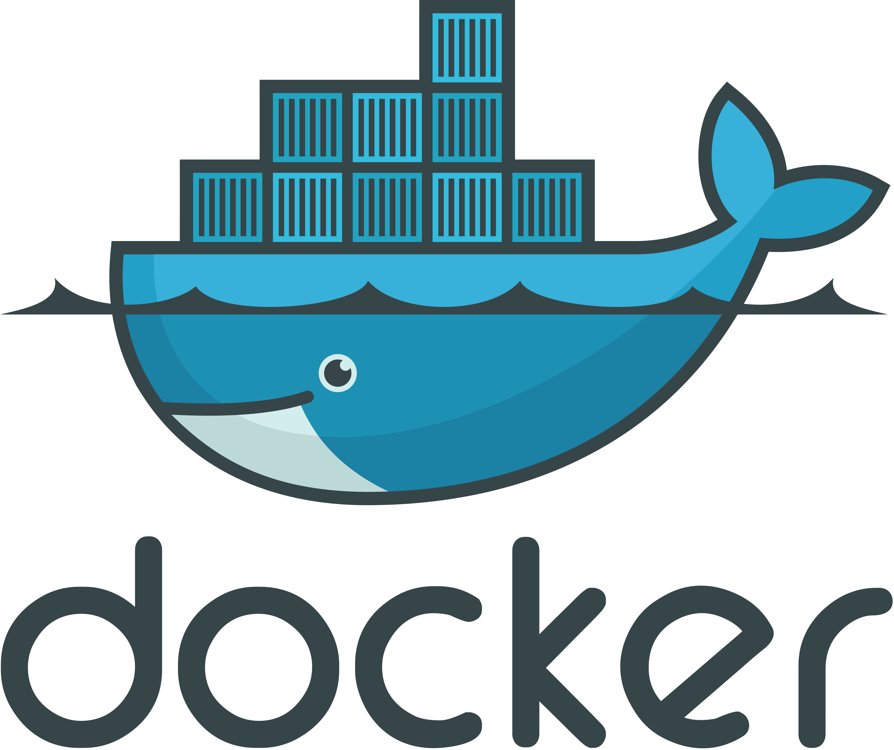

N'hésitez pas à me contacter pour toute demande de devis ou question !

[antoine.roygarnier@gmail.com](antoine.roygarnier@gmail.com)

## À propos de moi
Data scientist en freelance, diplômé de l'ENSAE en Data Science, j'ai plus de 4 ans d'expérience en analyse des données, machine learning, NLP, télédétection (remote sensing), analyse géospatiale, cartographie (GIS) et web scraping. J'ai à la fois collaboré au développement de logiciel au sein d'une équipe en développement continu mais aussi contribué à des projets courts en format conseil.

Je suis particulièrement intéressé par les projets en politique publique, dans l'agriculture, l'énergie, l'environnement ou des projets à impact social positif (économie sociale et solidaire, projets environnementaux, développement, ...).

## Solutions

**\>>** Analyse de données structurées et non structurées (texte, image) et restitution des analyses sur une plateforme web ou dans un rapport (pdf/word) \
**\>>** Analyses géospatiales et télédéction pouvant être restituées dans des cartes ou plateforme \
**\>>** Web scraping et structuration de données \
**\>>** Développement de modules Python de Machine Learning ou de traitement des données \
**\>>** Support aux équipes data des entreprises \
**\>>** Ingéniérie logicielle en Python \
**\>>** ...

Les technologies que j'utilise:

## Expériences

**Depuis Novembre 2021, Data Scientist, Freelance**

_Appui en data science sur des projets et développement de logiciels_

**Mars 2020 - Novembre 2021, Data Scientist & Project Manager, Masae Analytics**

_Conseil en data science pour des institutions publiques et privées en Europe, en Afrique et au Moyen Orient
(Remote Sensing, Geospatial Analysis, NLP):_
- Evaluation de la déforestation au Sahel pour l'Agence Française du Développement
- Evaluation des dégats causés par les criquets sur les cultures en Afrique de l'Est
- Plateforme geo-marketing pour cartographier la fracture numérique en Europe et en Afrique pour un opérateur satellite
- Analyse des réseaux sociaux des appels au boycott au Maghreb et au moyen Orient pour une multinationale

**Mai 2018 - Mars 2020, Data Scientist, eXplain**

_Développement d'algorithmes (Python, NLP, scraping):_
- outil de Machine Learning pour classer les articles de presse par sujet
- outit de scraping des sites internets des collectivités locales françaises pour récupérer les documents administratifs
- outil pour sélectionner automatiquement le meilleur extrait des articles de presse

**Janvier 2017 - Juillet 2017, Analyste, Altai Consulting**

_Analyse de données pour plusieurs études d'évaluation de projet en Somalie (pour la Banque Mondiale, DFID, UK FCO)_

Développement de plans de sondage pour plusieurs études (Somali High Frequency Survey)

**Juin 2016 - Décembre 2016, Assistant de Recherche, CEPREMAP** 

_Développement d'un modèle statistique de prédiction de la croissance du PIB aux Etats-Unis_

## Éducation

**2014-2018 Master en Data Science ENSAE**

**2017-2018 Auditeur libre au master de Politiques Publiques et Dévelopement Paris School of economics**

**2012-2014 CPGE B/L Lycée Thiers**
