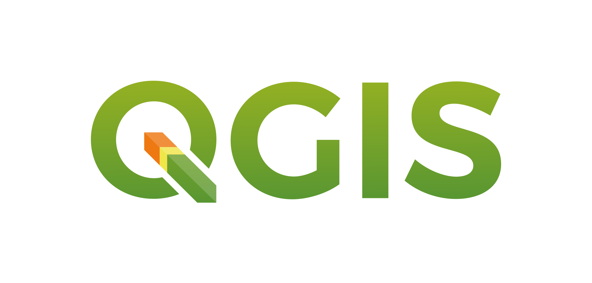
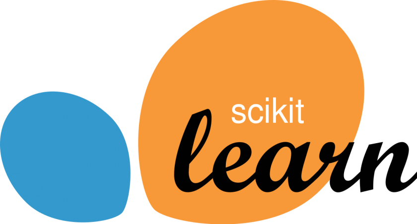

<a href="/" style="color: #969FDC; "><u>Version Française</u></a>

Do not hesitate to contact me for any request for a quote or question!

<a href="mailto:antoine.roygarnier@gmail.com" style="color: #464646; "><u>antoine.roygarnier@gmail.com</u></a>

## About

Freelance data scientist, graduated from ENSAE in Data Science, I have more than 4 years of experience in data analysis, Machine Learning, NLP, remote sensing, geospatial analysis, cartography (GIS) and web scraping. I have both collaborated in software development and contributed to short projects in a consulting format.

I help public and private actors to get the most out of their data. I can integrate into existing dev and data teams or respond to a specific need and develop my own solutions.

I am particularly interested in projects in public policy, agriculture, energy, environment or projects with positive social impact (social economy, environmental projects, development).
I also help researchers who need research engineers to analyse their data.

## Services

<table style="width:100%; border: 0px">
<tr>
    <td style="width: 33%; border: 0px"> 
     
     
      
     Web scraping and data structuration  
     
     
     
     Geospatial analysis and remote sensing (results can be exposed on a web platform or on maps)
    </td>
    <td style="width: 33%; border: 0px">
      
    Development of Python modules for Machine Learning or data mining 
     
       
      
    Support to data teams  
    </td>
    <td style="width: 34%; border: 0px">
     
     
      
    Software engineering (Python) 
     
     
     
    Structured and unstructure data analysis (text, images) and production of output (pdf/word, web platform) 
    </td>
</tr>
</table>
 

**Tools**

 

**Achievements** (recent projects)
 
 
 Development of a Python tool to download tweets on a topics and build graph of accounts interactionson that topic for the State start-up Disinfo ((Ambassador for digital affairs); code is available <a href="https://github.com/ambanum/social-networks-graph-generator" style="color: #464646; "><u>here</u></a> 
 
 

## Experience

**Since November 2021, Data Scientist, Freelance**

_Data Science projects and software development_

**March 2020 - November 2021, Data Scientist & Project Manager, Masae Analytics**

_Data Science Consulting for clients in Africa, the Middle-East and Europe_
(_Remote Sensing, Geospatial Analysis, NLP):_
- Deforestation assessment in the Sahel region for the French Development Agency
- Geo-marketing platform and digital divide mapping for a satellite operator
- Social Network Analysis of call for boycott and offensive opinion in Maghreb for brand protection, for a global consumer goods firm

**May 2018 - March 2020, Data Scientist, eXplain**

_Development of data science algorithms:_
- Machine Learning tool to automate newspaper articles classification by topic
- Web Scraping tool to automate data collection of administrative documents from French administrations
- Tool to automatically select most relevant excerpts from newspaper articles

**January 2017 - July 2017, Analyst, Altai Consulting**

_Data analysis for several aid projects in Somalia and South Soudan_

Development of the sampling frame for the Somali High Frequency Survey (World Bank)

**June 2016 - December 2016, Research Assistant, CEPREMAP** 

_Development of a statistics model to forecast US GDP growth_

## Education

**2014-2018 Master’s degree in Engineering (_Major in Data Science_) ENSAE**

**2017-2018 Public Policy and Development Paris School of economics**

**2012-2014 CPGE B/L (_Lettres et Sciences Sociales_) Lycée Thiers**
